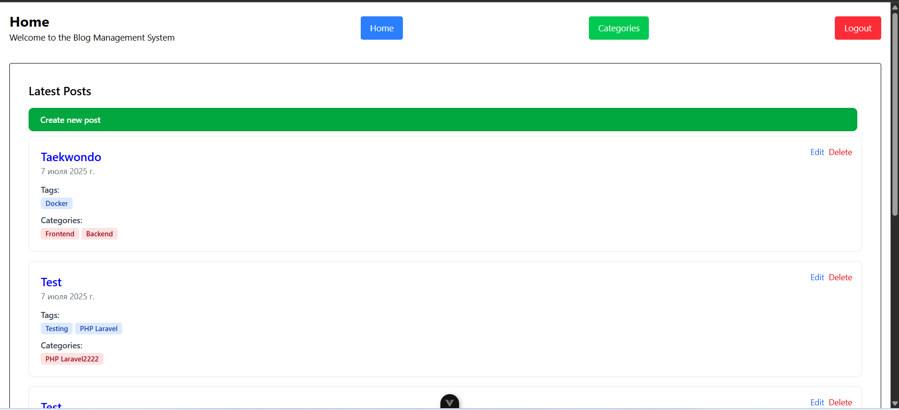
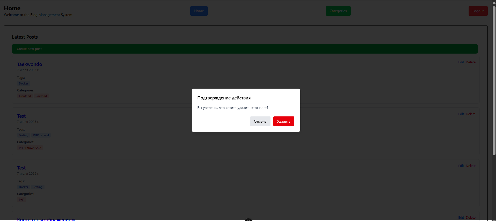
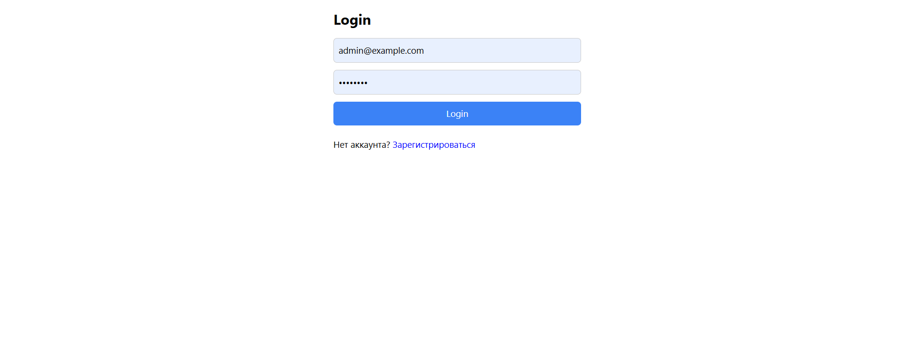
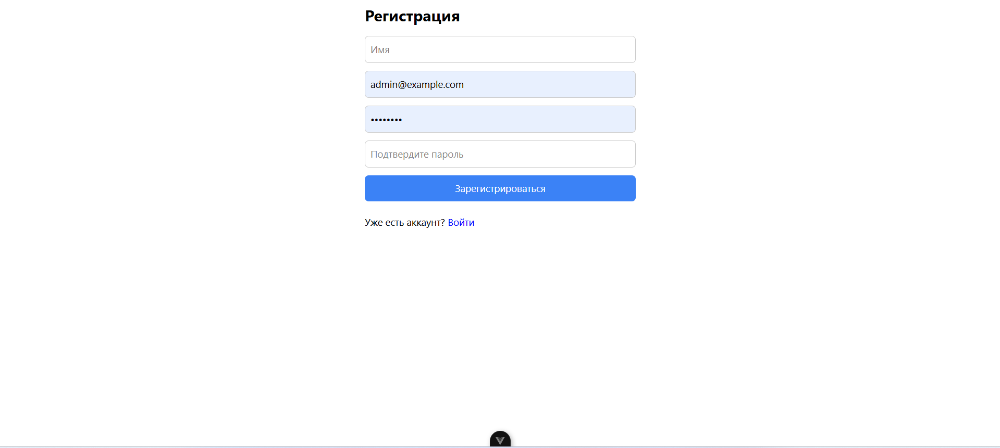
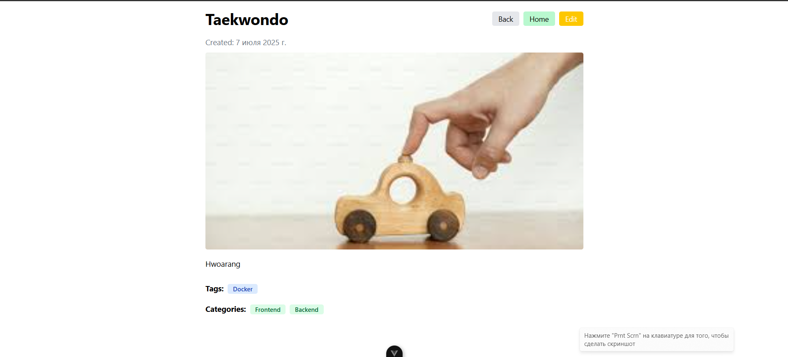
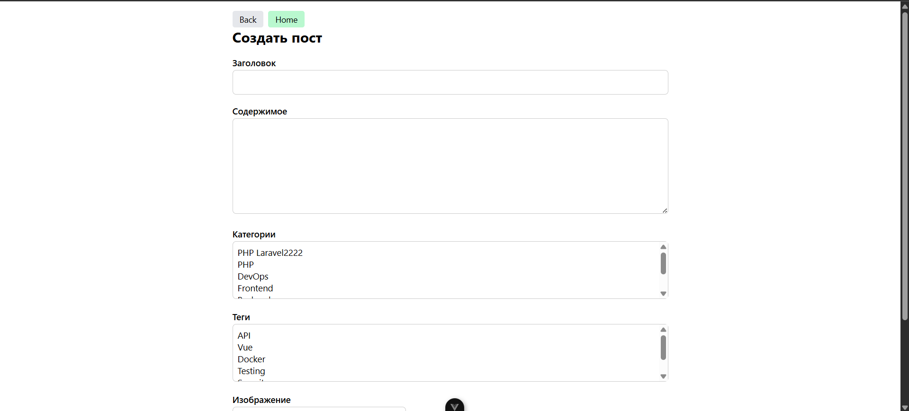
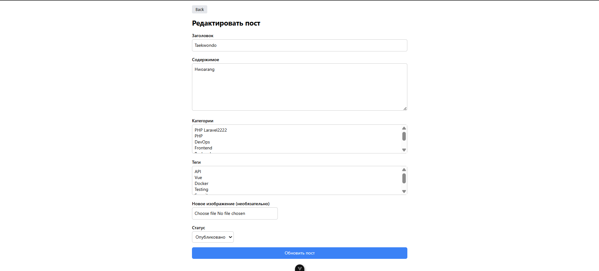
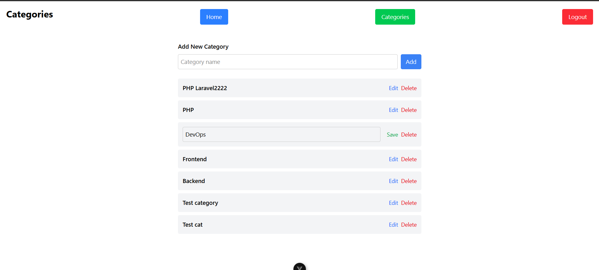

# Frontend Blog Management System

## 📝 Project Overview

This project is a frontend application for a Blog Management System. It interacts with a Laravel-powered RESTful API and provides role-based CRUD functionality for posts, categories, and tags.

## ⚙️ Tech Stack

* **Vue.js 3** with Vite
* **Tailwind CSS** for styling
* **Axios** for HTTP requests
* **Vue Router** for navigation
* **Pinia** for state management

## 🚀 Setup Instructions

### Prerequisites

* Node.js (v18 or above)
* npm or yarn

### Installation

```bash
# Clone the repository
$ git clone https://github.com/your-username/blog-frontend.git
$ cd blog-frontend

# Install dependencies
$ npm install

# Copy and configure environment variables
$ cp .env.example .env

# Start the development server
$ npm run dev
```

### .env Example

```env
VITE_API_BASE_URL=http://localhost:8000/api
```

## 🔐 Authentication

* Login and registration are connected to the Laravel API.
* On successful login, the token is stored in `localStorage`.
* The token is automatically attached to all API requests using Axios interceptors.

## 📚 Features

### Authentication

* ✅ Register
* ✅ Login
* ✅ Logout

### Blog Management

* ✅ List blog posts (with pagination)
* ✅ View post details
* ✅ Create / Edit / Delete posts (based on permissions)
* ✅ Upload featured image

### Categories & Tags

* ✅ List, create, update, delete (for authorized roles)

### Role-Based UI

* 🧩 Roles: Admin, Editor, Author, Reader
* 🔐 Permissions: `manage_posts`, `publish_posts`, `edit_posts`, `delete_posts`, `manage_categories`, `manage_users`
* UI elements and routes are conditionally rendered based on role permissions.

## 🧠 Architecture

* `src/components`: Reusable UI components
* `src/views`: Page-level components
* `src/stores`: Pinia stores for auth, user, posts, etc.
* `src/router`: Vue Router setup and route guards
* `src/services`: Axios instance and API calls

## 🔧 API Integration

* All endpoints are consumed based on the [OpenAPI specification](http://localhost:8000/api/documentation).
* Error handling and loading states are managed per request.

## ✨ Extras (Optional Enhancements)

* [ ] Toast notifications
* [ ] Modal confirmations
* [ ] Dark mode toggle
* [ ] Component/unit tests using Vitest

## 📸 Screenshots










## 📬 Contact

If you have any questions or suggestions:

**Email:** `flashtima@gmail.com`

---
